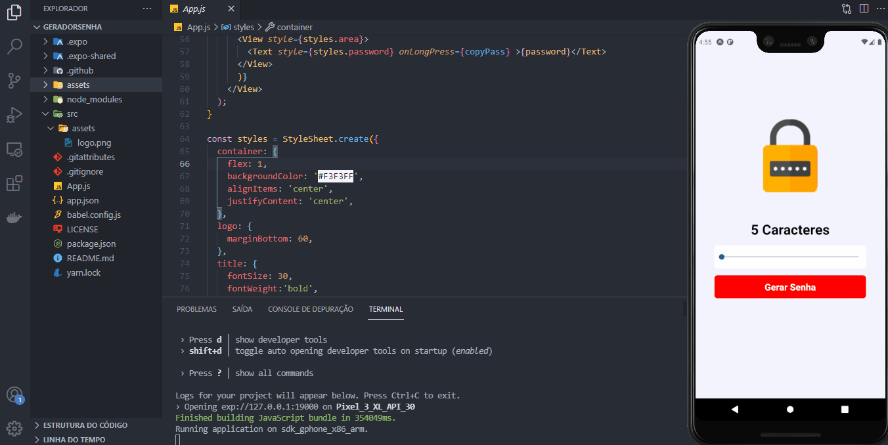

 <h1 align="center">
    
</h1>

<p align="center">
  <a href="#technologies">Technologies</a>&nbsp;&nbsp;&nbsp;|&nbsp;&nbsp;&nbsp;
  <a href="#-layout">Getting started</a>&nbsp;&nbsp;&nbsp;|&nbsp;&nbsp;&nbsp;
  <a href="#-project">Project</a>&nbsp;&nbsp;&nbsp;|&nbsp;&nbsp;&nbsp;
  <a href="#-license">License</a>
</p>

<p align="center">

  [](https://github.com/israel206)
  [](#)
  
  
  
  
</p>

<br>

<p align="center">
  
</p>
</p>

---

## 🧪 Technologies

This project was developed using the following technologies:

- [React Native](https://reactnative.dev/)
- [Expo](https://expo.io/)
- [TypeScript](https://www.typescriptlang.org/)

---

## 🚀 Getting started

Clone the project and access the folder

```bash
git clone https://github.com/israel206/geradorSenha.git
```

Follow the steps below

```bash
# Install the dependencies
$ yarn install

# Start the project
$ expo start
```

---

## 💻 Project

App to always remember to water your plants 🌱

mobile application development

---

## 📝 License

This project is licensed under the MIT License. See the [LICENSE](LICENSE.md) file for details.

---

Made with 💜 [by Israel Silva](https://israel206.github.io/) 👋

[ts]: https://www.typescriptlang.org
[vscode]: https://code.visualstudio.com/
[yarn]: https://yarnpkg.com/
[vceditconfig]: https://marketplace.visualstudio.com/items?itemName=EditorConfig.EditorConfig
[vceslint]: https://marketplace.visualstudio.com/items?itemName=dbaeumer.vscode-eslint
